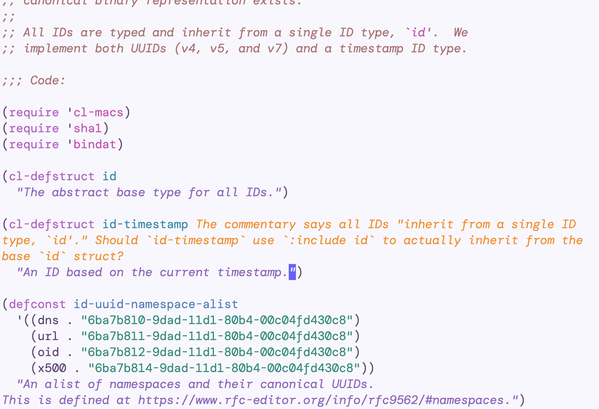
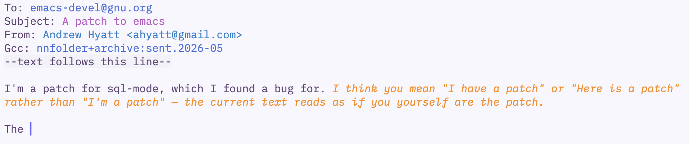

#+title: llm-buddy

llm-buddy is an Emacs package that watches your recent buffer edits and asks an
LLM to review them.  When it finds something worth pointing out, it can add a
short inline note in the relevant buffer or show a message in a popup buffer (it
usually does the former).

The goal is lightweight feedback while you work: typos, logic mistakes,
questionable edits, or prose issues that a normal compiler, linter, or spell
checker may not catch.

* Screenshots

An Emacs Lisp editing example:

A prose/mail example in Gnus:

* How it works

llm-buddy records changes in tracked buffers, groups nearby edits together, and
formats the net change as a numbered unified diff.  On idle, or when you call
~llm-buddy-advice~, it sends that diff to the configured provider from the
~llm~ package.

Inline note overlays are dismissed automatically when the annotated line is
edited, or manually with ~llm-buddy-dismiss-note~ and ~llm-buddy-dismiss-notes~.

* Setup

Load the package and configure an ~llm~ provider:

#+begin_src emacs-lisp
(add-to-list 'load-path "~/src/llm-buddy")
(require 'llm-buddy)

;; Example only: set this to whatever provider object your llm setup uses.
(setq llm-buddy-provider my-llm-provider)
#+end_src

Then enable automatic review:

#+begin_src emacs-lisp
(llm-buddy-global-mode 1)
#+end_src

You can also run one review manually:

#+begin_src emacs-lisp
(llm-buddy-advice)
#+end_src

* Main commands

- ~llm-buddy-global-mode~ enables or disables global tracking and idle review.
- ~llm-buddy-auto-start~ starts automatic review.
- ~llm-buddy-auto-stop~ stops automatic review.
- ~llm-buddy-advice~ reviews the current scope's recent changes now.
- ~llm-buddy-clear-history~ clears recorded change history.
- ~llm-buddy-dismiss-note~ dismisses the llm-buddy note on the current line.
- ~llm-buddy-dismiss-notes~ dismisses all visible llm-buddy notes.

Useful options:

- ~llm-buddy-provider~ is the provider used for advice.
- ~llm-buddy-tracked-modes~ controls which major modes are watched.
- ~llm-buddy-coalesce-window~ controls how nearby edits are merged.
- ~llm-buddy-auto-interval~ controls the minimum time between automatic runs.
- ~llm-buddy-auto-idle-delay~ controls how long Emacs must be idle first.
- ~llm-buddy-max-iterations~ bounds the tool-use loop for one review.

* Quality and benchmarks

~llm-buddy-quality.el~ helps capture and judge real advice runs.  Enable
~llm-buddy-debug-mode~, run ~llm-buddy-advice~, then call ~llm-buddy-judge~ to
mark the captured diff as clean or as requiring expected warnings.  Saved cases
are written under ~quality/~.  This code is a work in progress.

~llm-buddy-benchmark.el~ contains a small benchmark suite that measures review
quality with precision, recall, and F1:

#+begin_src emacs-lisp
(require 'llm-buddy-benchmark)
(llm-buddy-benchmark-run)
#+end_src

Reports can be displayed in Emacs or written to Markdown and HTML:

#+begin_src emacs-lisp
(llm-buddy-benchmark-report)
(llm-buddy-benchmark-write-report)
(llm-buddy-benchmark-write-html)
#+end_src

* Why not a flycheck backend?

The purpose of this package is to provide a commentary on new text added, not pre-existing text.  =flycheck= and =flymake= both check the entire buffer or file for issues, while =llm-buddy= only checks changed items.  It also supports dismissing notes.
